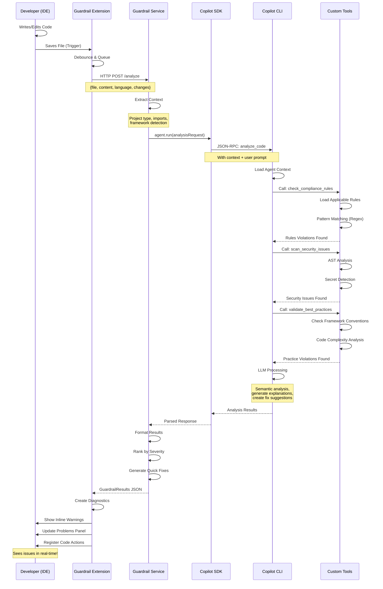
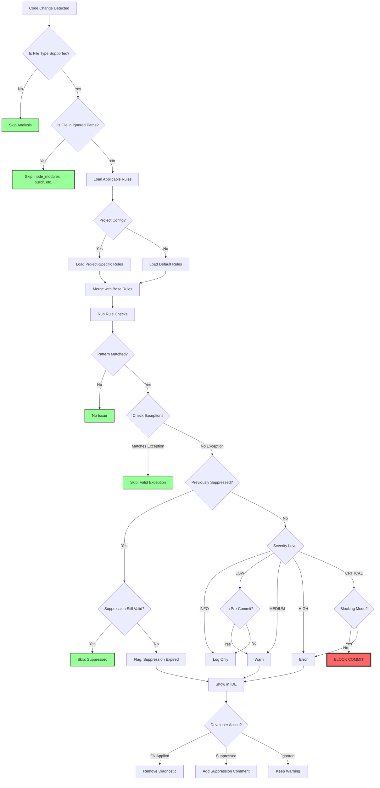

# Runtime Guardrail System - Detailed Workflow Sequences

## 🔄 **Sequence 1: Real-Time Code Analysis Flow**



---

## 🚦 **Sequence 2: Developer Interaction - Applying a Fix**

```mermaid
sequenceDiagram
    participant Dev as Developer
    participant IDE as VS Code
    participant Ext as Guardrail Extension
    participant Svc as Guardrail Service
    
    Note over Dev,IDE: Developer sees warning:<br/>"Hardcoded API Key [SEC-001]"
    
    Dev->>IDE: Hover over Warning
    IDE->>Ext: Request Details
    Ext->>IDE: Show Rich Hover
    Note over IDE: Displays:<br/>- Issue description<br/>- Compliance impact<br/>- Suggested fix<br/>- Documentation links
    
    Dev->>IDE: Click "Quick Fix" (💡)
    IDE->>Ext: Request Code Actions
    Ext->>IDE: Provide Actions
    Note over IDE: Options:<br/>1. Apply Suggested Fix<br/>2. View Full Details<br/>3. Ask AI for Alternatives<br/>4. Suppress (with reason)
    
    alt Apply Suggested Fix
        Dev->>IDE: Select "Apply Fix"
        Ext->>Ext: Get Fix from Cache
        Ext->>IDE: Apply Text Edit
        IDE->>IDE: Replace Code
        Note over IDE: Before:<br/>const key = "sk-123"<br/><br/>After:<br/>const key = process.env.API_KEY
        
        Ext->>Ext: Remove Diagnostic
        IDE->>Dev: Show Success Message
        Note over Dev: ✅ "Fix applied! Consider adding<br/>API_KEY to .env file"
        
    else Ask AI for Alternatives
        Dev->>Ext: Click "Ask AI"
        Ext->>Svc: POST /chat
        Note over Ext,Svc: {<br/>  issue_id: "SEC-001",<br/>  question: "alternatives?"<br/>}
        
        Svc->>Svc: Start Chat Session
        Note over Svc: Load issue context,<br/>project context
        
        Svc-->>Ext: Chat Response
        Note over Svc: "Here are 3 approaches:<br/>1. Environment variables<br/>2. Azure Key Vault<br/>3. Config file (gitignored)"
        
        Ext->>IDE: Open Chat Panel
        IDE->>Dev: Show AI Response
        
        Dev->>IDE: Type: "How do I use Key Vault?"
        IDE->>Ext: Send Message
        Ext->>Svc: Continue Chat
        Svc-->>Ext: Detailed Instructions
        
    else Suppress with Reason
        Dev->>IDE: Select "Suppress"
        IDE->>Dev: Prompt for Reason
        Dev->>IDE: Enter: "This is a demo key"
        
        Ext->>Ext: Add Suppression
        Note over Ext: Add inline comment:<br/>// guardrail-ignore SEC-001: demo key
        
        Ext->>Svc: Log Suppression
        Note over Svc: Track for audit
    end
```



---

## 🔍 **Sequence 3: Compliance Rule Evaluation**

```mermaid sequenceDiagram
    participant CLI as Copilot CLI
    participant Tool as Compliance Tool
    participant Rules as Rules Engine
    participant KB as Knowledge Base
    participant LLM as Language Model
    
    CLI->>Tool: check_compliance_rules(code, regulations)
    Note over CLI,Tool: Input:<br/>- Code snippet<br/>- Language: Python<br/>- Regulations: [GDPR, HIPAA]
    
    Tool->>Rules: Load Rules for [GDPR, HIPAA]
    Rules->>Rules: Filter by Language (Python)
    Rules->>Rules: Filter by File Type (*.py)
    Rules-->>Tool: Applicable Rules (15 rules)
    
    loop For Each Rule
        Tool->>Tool: Check Rule Type
        
        alt Regex Pattern Matching
            Tool->>Tool: Execute Regex
            Tool->>Tool: Check for Matches
            Note over Tool: Pattern: log.*email.*password
            
        else AST Analysis
            Tool->>Tool: Parse Code to AST
            Tool->>Tool: Traverse AST Nodes
            Note over Tool: Looking for:<br/>- Function calls: logger.info()<br/>- Arguments contain PII
            
        else Semantic Check (LLM)
            Tool->>LLM: Analyze Semantically
            Note over Tool,LLM: "Does this code log PII<br/>without redaction?"
            LLM-->>Tool: Analysis Result
            Note over LLM: "Yes, logging email<br/>and phone number"
        end
        
        alt Violation Found
            Tool->>KB: Get Detailed Info
            KB-->>Tool: Return Rule Details
            Note over KB: - Description<br/>- Compliance mapping<br/>- Remediation steps<br/>- Code examples
            
            Tool->>Tool: Create Violation Object
            Note over Tool: {<br/>  rule_id: "GDPR-003",<br/>  severity: "HIGH",<br/>  line: 42,<br/>  compliance: {...}<br/>}
        end
    end
    
    Tool->>Tool: Rank Violations
    Note over Tool: Priority:<br/>1. Severity<br/>2. Compliance Impact<br/>3. Exploitability
    
    Tool->>LLM: Generate Explanations
    Note over Tool,LLM: "Explain these violations<br/>in developer-friendly language"
    LLM-->>Tool: Human-Readable Explanations
    
    Tool->>LLM: Generate Fix Suggestions
    LLM-->>Tool: Code Fix Snippets
    
    Tool-->>CLI: Return Structured Results
    Note over Tool: [{<br/>  violation,<br/>  explanation,<br/>  fix,<br/>  compliance_impact<br/>}]
```

---

## ⚙️ **Sequence 4: Git Pre-Commit Hook Integration**

```mermaid
sequenceDiagram
    participant Dev as Developer
    participant Git as Git (pre-commit)
    participant Hook as Guardrail Hook
    participant Svc as Guardrail Service
    participant CLI as Copilot CLI
    
    Dev->>Git: git commit -m "Add feature"
    Git->>Hook: Trigger pre-commit hook
    
    Hook->>Git: Get Staged Files
    Git-->>Hook: List of Changed Files
    Note over Hook: src/api.py<br/>src/utils.py<br/>README.md
    
    Hook->>Hook: Filter Relevant Files
    Note over Hook: Ignore: README.md<br/>Analyze: *.py files
    
    Hook->>Svc: POST /analyze-batch
    Note over Hook,Svc: {<br/>  files: [api.py, utils.py],<br/>  mode: "pre-commit",<br/>  blocking: true<br/>}
    
    Svc->>CLI: Batch Analysis
    CLI-->>Svc: Results for All Files
    
    Svc->>Svc: Check Severity
    
    alt Critical Issues Found
        Svc-->>Hook: {<br/>  status: "BLOCK",<br/>  critical_issues: [...]<br/>}
        
        Hook->>Hook: Format Error Message
        Hook-->>Git: Exit Code 1 (Block)
        
        Git-->>Dev: ❌ Commit Blocked!
        Note over Dev: 🚨 Critical Issues Found:<br/><br/>src/api.py:42<br/>  • Hardcoded Password [SEC-002]<br/>  • Impact: SOC2 Violation<br/><br/>Fix these issues or use:<br/>  git commit --no-verify<br/>(requires justification)
        
        Dev->>Dev: Fix Issues
        Dev->>Git: git commit (retry)
        
    else Warnings Only
        Svc-->>Hook: {<br/>  status: "WARN",<br/>  warnings: [...]<br/>}
        
        Hook->>Dev: ⚠️ Display Warnings
        Note over Hook: Non-blocking warnings:<br/>- Code complexity<br/>- Missing tests<br/>- Documentation
        
        Hook-->>Git: Exit Code 0 (Allow)
        Git->>Git: Proceed with Commit
        
        Hook->>Svc: Log Commit Event
        Note over Hook,Svc: Track warnings<br/>for analytics
        
    else No Issues
        Svc-->>Hook: {status: "OK"}
        Hook-->>Git: Exit Code 0
        Git->>Git: Commit Success
        Git-->>Dev: ✅ Commit Created
    end
```



---

## 🔄 **Sequence 5: Continuous Learning & Feedback Loop**

```mermaid
sequenceDiagram
    participant Dev as Developer
    participant Ext as Extension
    participant Svc as Service
    participant DB as Analytics DB
    participant ML as ML Pipeline
    participant Rules as Rules Repository
    
    Note over Dev,Rules: Feedback Loop for Continuous Improvement
    
    Dev->>Ext: Reviews Warning
    
    alt False Positive
        Dev->>Ext: Mark as "Not an Issue"
        Ext->>Svc: POST /feedback
        Note over Ext,Svc: {<br/>  finding_id: "...",<br/>  feedback: "false_positive",<br/>  reason: "Test code"<br/>}
        
        Svc->>DB: Store Feedback
        Note over DB: Track:<br/>- Rule ID<br/>- Context<br/>- Developer reasoning
        
        DB->>ML: Trigger Analysis (weekly)
        ML->>ML: Analyze Patterns
        Note over ML: "Rule SEC-015 has<br/>40% false positive rate<br/>in test files"
        
        ML->>Rules: Suggest Rule Update
        Note over Rules: Add exception:<br/>exclude: **/*test*
        
        Rules->>Svc: Update Rules
        Svc->>Svc: Reload Rules
        
    else Helpful Finding
        Dev->>Ext: Apply Fix
        Ext->>Svc: POST /feedback
        Note over Ext,Svc: {<br/>  feedback: "helpful",<br/>  fix_applied: true,<br/>  time_to_fix: 30s<br/>}
        
        Svc->>DB: Store Success Metric
        Note over DB: Track effectiveness:<br/>- Time saved<br/>- Issues prevented<br/>- Developer satisfaction
        
    else Confusing/Unclear
        Dev->>Ext: Rate "Needs Improvement"
        Dev->>Ext: Comment: "Explanation unclear"
        
        Ext->>Svc: POST /feedback
        Svc->>DB: Store Feedback
        
        DB->>ML: Analyze Complaints
        ML->>ML: Identify Pattern
        Note over ML: "Finding GDPR-003<br/>explanation rated<br/>low by 60% of users"
        
        ML->>Rules: Flag for Review
        Note over Rules: Human reviewer improves<br/>explanation text and<br/>adds better examples
    end
    
    Note over DB,ML: Weekly Report Generated
    ML->>ML: Generate Insights
    Note over ML: - Most helpful rules<br/>- False positive rates<br/>- Coverage gaps<br/>- Adoption metrics
    
    ML-->>Dev: Share Insights (Dashboard)
    Note over Dev: Team Dashboard:<br/>✅ 87% issues caught pre-commit<br/>⚡ Avg fix time: 2.5 min<br/>📉 Security issues down 65%
```



---

## 🎯 **Sequence 6: Team Dashboard & Analytics**

```mermaid
sequenceDiagram
    participant Manager as Engineering Manager
    participant Dashboard as Web Dashboard
    participant API as Analytics API
    participant DB as Analytics DB
    participant Svc as Guardrail Service
    
    Manager->>Dashboard: Opens Team Dashboard
    Dashboard->>API: GET /analytics/team-summary
    
    API->>DB: Query Last 30 Days
    DB-->>API: Aggregated Metrics
    
    API-->>Dashboard: {<br/>  total_scans: 1247,<br/>  issues_found: 342,<br/>  issues_fixed: 318,<br/>  avg_fix_time: "3.2 min",<br/>  compliance_score: 94,<br/>  top_violations: [...]<br/>}
    
    Dashboard->>Dashboard: Render Visualizations
    
    Note over Dashboard: 📊 Compliance Health: 94/100<br/>📉 Trend: ↑ 12% vs last month<br/>⚡ Top Issues:<br/>  1. Hardcoded secrets (45)<br/>  2. Missing error handling (38)<br/>  3. PII logging (22)
    
    Manager->>Dashboard: Click "Security Issues"
    Dashboard->>API: GET /analytics/security-details
    
    API->>DB: Query Security Violations
    DB-->>API: Detailed Breakdown
    
    Dashboard->>Manager: Show Details
    Note over Dashboard: Security by Category:<br/>🔴 Critical: 2 (↓ 6)<br/>🟡 High: 12 (↓ 15)<br/>🔵 Medium: 28 (↑ 3)<br/><br/>OWASP Top 10 Coverage:<br/>✅ Injection: 98%<br/>✅ Auth: 95%<br/>⚠️ XSS: 87%
    
    Manager->>Dashboard: Click "Export Report"
    Dashboard->>API: POST /reports/generate
    
    API->>API: Generate PDF Report
    Note over API: Include:<br/>- Executive summary<br/>- Compliance evidence<br/>- Audit trail<br/>- Remediation status
    
    API-->>Dashboard: report.pdf
    Dashboard-->>Manager: Download Report
    
    Note over Manager: Share with:<br/>- Compliance team<br/>- Security audit<br/>- Leadership
    
    Manager->>Dashboard: Configure Alerts
    Note over Dashboard: Set up alerts:<br/>• Critical issue found<br/>  → Slack #security<br/>• Compliance score < 90<br/>  → Email team leads<br/>• Weekly summary<br/>  → All developers
    
    Dashboard->>API: POST /alerts/configure
    API->>DB: Save Alert Rules
    
    loop Real-Time Monitoring
        Svc->>DB: Log New Finding (Critical)
        DB->>API: Trigger Alert Rule
        API->>API: Check Conditions
        
        alt Critical Security Issue
            API->>API: Send Alert
            Note over API: Slack notification:<br/>"🚨 Critical SQL Injection<br/>found in payment-service<br/>by @developer"
        end
    end
```



---

## 💭 **Decision Flow: Should This Be Flagged?**



---

## 🏃 **Quick Reference: Analysis Timeline**

| Stage | Time | Activity | Caching |
|-------|------|----------|---------|
| **Trigger** | 0ms | File save/type event | - |
| **Debounce** | 0-2s | Wait for typing to stop | - |
| **Context** | 50-200ms | Extract file context, imports | ✅ Project metadata |
| **Rule Load** | 10-50ms | Load applicable rules | ✅ Rules cached |
| **SDK Call** | 100-500ms | Send to Copilot agent | - |
| **Analysis** | 1-3s | LLM + tool execution | ⚠️ Partial |
| **Format** | 50ms | Parse and rank results | - |
| **Display** | 10ms | Show in IDE | - |
| **TOTAL** | **2-5s** | End-to-end | |

**Optimization Opportunities:**
- Cache previous analysis for unchanged code
- Incremental analysis (only changed functions)
- Parallel processing of independent files
- Background re-analysis of related files

---

## 🎯 **Summary: The Developer Experience**

1. **👨‍💻 Developer Codes**: No interruption, natural workflow
2. **⚡ Instant Feedback**: Issues shown in ~3 seconds
3. **💡 Smart Suggestions**: Context-aware, actionable fixes
4. **🎓 Learn Continuously**: Understands *why* things matter
5. **✅ Fix Quickly**: One-click fixes when possible
6. **🚀 Ship Confidently**: Compliance handled automatically

**The goal: Make doing the right thing the easy thing!**
